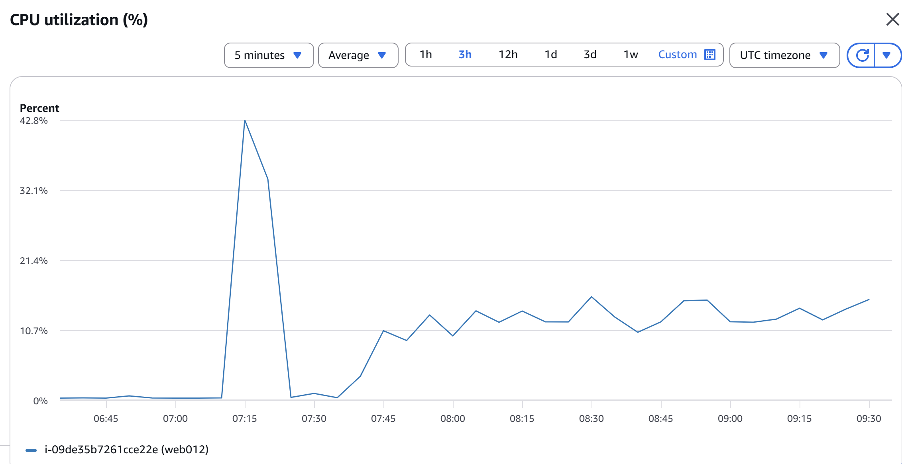
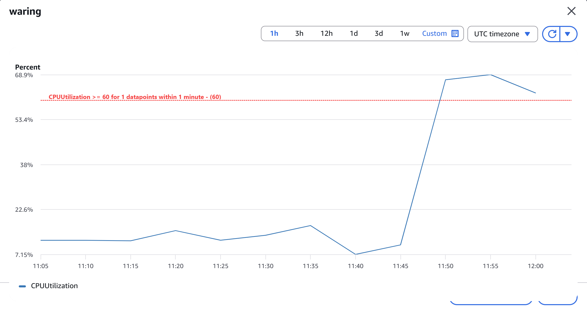

# Random CPU Spike Simulator

A simple bash script to simulate random CPU spikes. Useful for testing AWS EC2 Auto Scaling groups and validating CloudWatch alarms within automated CI/CD pipelines (DCO).

## Resource Monitoring & Comparison

### 1. Server Idle State (Normal)
During the `sleep` phase of the script, server resources remain stable, allowing normal services to run without interruption.


### 2. Server Stress State (Active Spikes)
When the random timer triggers, the script uses the `stress` tool to max out CPU cores for 5 seconds. htop output during the stress test:


### 3. Idle vs. Stress State Comparison

| Metric | Idle State (Resting) | Stress State (Active Spikes) |
| :--- | :--- | :--- |
| **CPU Usage per Core** | ~ 0.5% - 2.0% | 100% on targeted cores |
| **Load Average (1 min)** | < 0.50 | Rapidly spikes above 4.00 |
| **Top Active Processes** | Background services (`httpd`, `htop`) | `stress` hogs dominate the top list |
| **System Behavior** | Responsive and fast | Potential minor delays depending on instance type |

### 4. AWS CloudWatch Visualization
CloudWatch metrics showing the simulated load and the sudden CPU utilization spike. This detection is critical for triggering Auto Scaling policies.



### 5. CloudWatch Alarm Triggering (Auto Scaling Event)
The primary goal of this stress test is to validate the alerting system. When CPU utilization crosses the predefined threshold (e.g., > 60%), the CloudWatch Alarm state transitions from `OK` to `ALARM`. 

This state change triggers the **AWS Auto Scaling Group**, initiating a scale-out event to automatically launch new EC2 instances.



## Prerequisites
Ensure the `stress` package is installed:
- **RHEL / Amazon Linux:** `sudo dnf install epel-release stress -y`
- **Debian / Ubuntu:** `sudo apt install stress -y`

## Execution Guide

**Foreground Execution (For direct observation):**
```bash
./random_stress.sh
