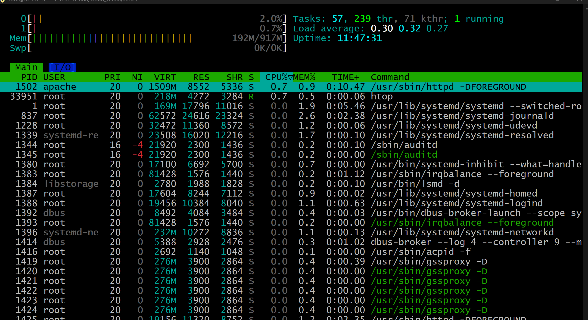
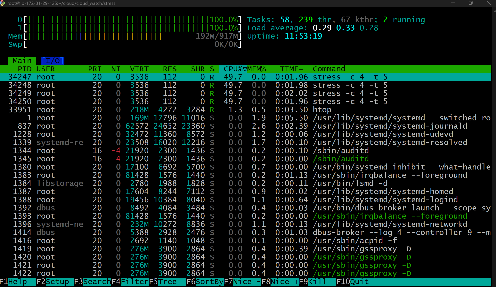

A lightweight bash script designed to simulate random CPU spikes. This tool is highly effective for testing AWS EC2 Auto Scaling groups and validating CloudWatch alarms within automated CI/CD pipelines (DCO) to ensure efficient cloud resource optimization.

## Resource Monitoring & Comparison

This section compares the server's state during normal operation versus when the stress script is active.

### 1. Server Idle State (Normal)
During the `sleep` phase of the script, the server resources remain stable, allowing normal services to run without interruption.



### 2. Server Stress State (Active Spikes)
When the random timer triggers, the script utilizes the `stress` tool to max out the CPU cores for 5 seconds. This is what it looks like:



### 3. Idle vs. Stress State Comparison

| Metric | Idle State (Resting) | Stress State (Active Spikes) |
| :--- | :--- | :--- |
| **CPU Usage per Core** | ~ 0.5% - 2.0% | 100% on targeted cores |
| **Load Average (1 min)** | < 0.50 | Rapidly spikes above 4.00 |
| **Top Active Processes** | Background services (`httpd`, `htop`) | `stress` hogs dominate the top list |
| **System Behavior** | Responsive and fast | Potential minor delays depending on instance type |

## Prerequisites
Ensure the `stress` package is installed:
- **RHEL / Amazon Linux:** `sudo dnf install epel-release stress -y`
- **Debian / Ubuntu:** `sudo apt install stress -y`

## Execution Guide

**1. Foreground Execution (For direct observation):**
```bash
./random_stress.sh
